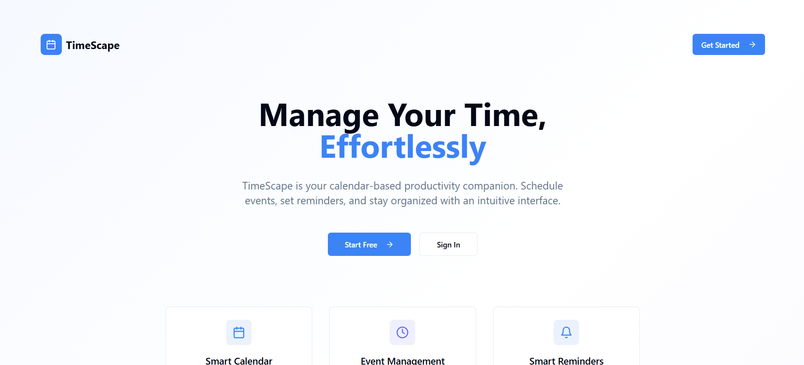

# TimeScape Calendar

A modern, feature-rich calendar application built with React, TypeScript, and Supabase. TimeScape helps you manage your events and reminders with a beautiful, intuitive interface.



## Features

- 📅 **Interactive Calendar View**
  - Month-by-month navigation
  - Quick event creation with hover buttons
  - Event preview on hover
  - Visual indicators for events and categories

- 🎯 **Event Management**
  - Create, edit, and delete events
  - Set event categories with color coding
  - Mark events as complete
  - Add time and reminders
  - Quick actions through event previews

- 📱 **Responsive Design**
  - Collapsible sidebar
  - Mobile-friendly interface
  - Adaptive layout for all screen sizes

- ⚡ **Real-time Features**
  - Live clock and date display
  - Location awareness
  - Event synchronization
  - Real-time updates

- 🔒 **User Authentication**
  - Secure login/signup
  - User-specific events
  - Profile management

## Tech Stack

- **Frontend Framework**: React with TypeScript
- **Styling**: Tailwind CSS with shadcn/ui components
- **Backend/Database**: Supabase
- **State Management**: React Hooks
- **Authentication**: Supabase Auth
- **Icons**: Lucide Icons
- **Build Tool**: Vite

## Getting Started

### Prerequisites

- Node.js (v16 or higher)
- npm or pnpm
- Supabase account

### Installation

1. Clone the repository:
   ```bash
   git clone https://github.com/yourusername/time-scape-cal.git
   cd time-scape-cal
   ```

2. Install dependencies:
   ```bash
   pnpm install
   ```

3. Create a `.env` file in the root directory:
   ```env
   VITE_SUPABASE_URL=your_supabase_url
   VITE_SUPABASE_ANON_KEY=your_supabase_anon_key
   ```

4. Start the development server:
   ```bash
   pnpm dev
   ```

### Setting up Supabase

1. Create a new Supabase project
2. Run the following SQL in your Supabase SQL editor:

```sql
-- Create events table
create table public.events (
  id uuid default uuid_generate_v4() primary key,
  created_at timestamp with time zone default timezone('utc'::text, now()) not null,
  title text not null,
  date date not null,
  time time with time zone,
  category text,
  reminder boolean default false,
  completed boolean default false,
  completed_at timestamp with time zone,
  user_id uuid references auth.users not null
);

-- Enable RLS
alter table public.events enable row level security;

-- Create policies
create policy "Users can view their own events"
  on events for select
  using (auth.uid() = user_id);

create policy "Users can insert their own events"
  on events for insert
  with check (auth.uid() = user_id);

create policy "Users can update their own events"
  on events for update
  using (auth.uid() = user_id);

create policy "Users can delete their own events"
  on events for delete
  using (auth.uid() = user_id);
```

## Usage

1. Sign up or log in to your account
2. Navigate through the calendar using the month controls
3. Click the '+' button on any date to add an event
4. Hover over events to see details and quick actions
5. Use the sidebar to view upcoming events and statistics
6. Toggle the sidebar for a fuller calendar view
7. Mark events as complete when finished

## Features in Detail

### Calendar View
- Monthly calendar with date navigation
- Event indicators with category colors
- Quick-add event buttons on date hover
- Event previews with detailed information
- Real-time clock and location display

### Event Management
- Create events with title, date, and time
- Assign categories with color coding
- Set reminders for important events
- Mark events as complete
- Quick delete and edit options

### Sidebar Features
- List of upcoming events
- Category-wise event statistics
- Collapsible for better space utilization
- Quick event actions

### Mobile Responsiveness
- Adaptive layout for all screen sizes
- Touch-friendly interface
- Collapsible sidebar for mobile view
- Optimized event previews for small screens


## Acknowledgments

- [shadcn/ui](https://ui.shadcn.com/) for the beautiful UI components
- [Supabase](https://supabase.com/) for the backend infrastructure
- [Lucide](https://lucide.dev/) for the icons
- [Tailwind CSS](https://tailwindcss.com/) for the styling system